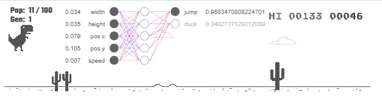

## AI-Dino
AI-Dino

## Neural Network
> Layers
- Inputs *3* ().
- Hidden *6*.
- OutPuts *2* ().

## Test Game
> In your Google Chrome browser:
`chrome://dino/`

## Developer Kit
> NodeJS
- Version
```sh
node -v
v10.21.0
```
> Dependencies modules `package.json`
```sh
"dependencies": {
    "express": "^4.17.1",
    "http": "0.0.1-security",
    "nodemon": "^2.0.7"
}
```

## Setup
> In your terminal run the command for create base:
`npm i`

## Run AI-Dino
> In your terminal run the command:
`nodemon .\bin\server.js`

## Screenshot
> General view.

